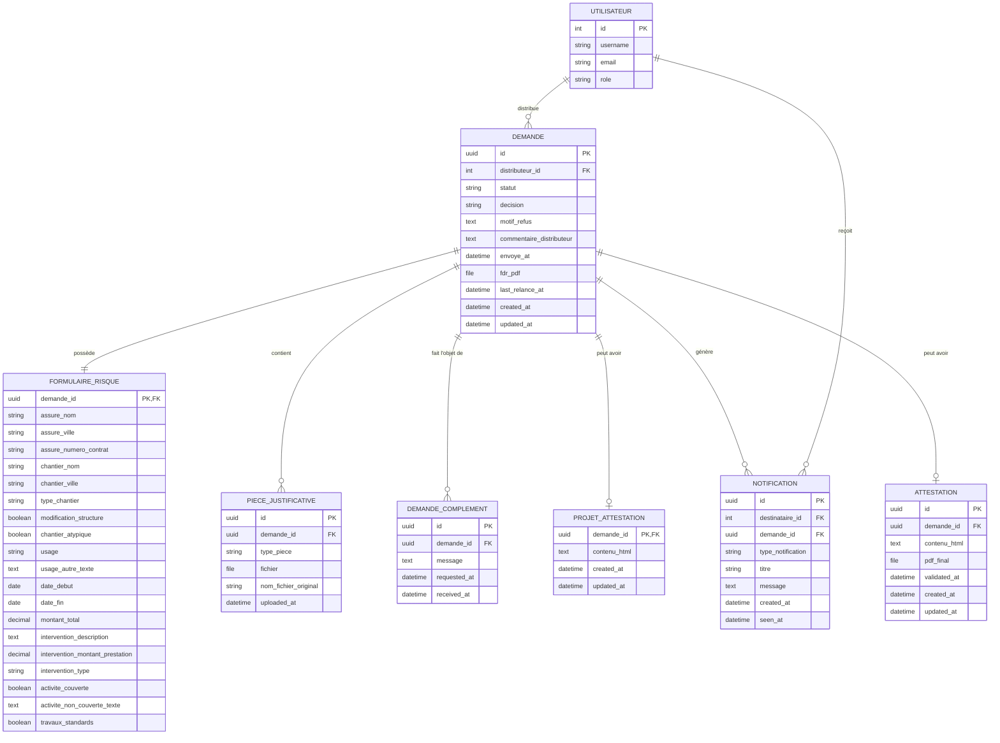

# Diagramme — Modèle de données

```mermaid
erDiagram
    UTILISATEUR ||--o{ DEMANDE : "distribue"
    UTILISATEUR ||--o{ NOTIFICATION : "reçoit"

    DEMANDE ||--|| FORMULAIRE_RISQUE : "possède"
    DEMANDE ||--o{ PIECE_JUSTIFICATIVE : "contient"
    DEMANDE ||--o{ DEMANDE_COMPLEMENT : "fait l'objet de"
    DEMANDE ||--o{ NOTIFICATION : "génère"
    DEMANDE ||--o| PROJET_ATTESTATION : "peut avoir"
    DEMANDE ||--o| ATTESTATION : "peut avoir"

    UTILISATEUR {
      int id PK
      string username
      string email
      string role
    }

    DEMANDE {
      uuid id PK
      int distributeur_id FK
      string statut
      string decision
      text motif_refus
      text commentaire_distributeur
      datetime envoye_at
      file fdr_pdf
      datetime last_relance_at
      datetime created_at
      datetime updated_at
    }

    FORMULAIRE_RISQUE {
      uuid demande_id PK,FK
      string assure_nom
      string assure_ville
      string assure_numero_contrat
      string chantier_nom
      string chantier_ville
      string type_chantier
      boolean modification_structure
      boolean chantier_atypique
      string usage
      text usage_autre_texte
      date date_debut
      date date_fin
      decimal montant_total
      text intervention_description
      decimal intervention_montant_prestation
      string intervention_type
      boolean activite_couverte
      text activite_non_couverte_texte
      boolean travaux_standards
    }

    PIECE_JUSTIFICATIVE {
      uuid id PK
      uuid demande_id FK
      string type_piece
      file fichier
      string nom_fichier_original
      datetime uploaded_at
    }

    DEMANDE_COMPLEMENT {
      uuid id PK
      uuid demande_id FK
      text message
      datetime requested_at
      datetime received_at
    }

    NOTIFICATION {
      uuid id PK
      int destinataire_id FK
      uuid demande_id FK
      string type_notification
      string titre
      text message
      datetime created_at
      datetime seen_at
    }

    PROJET_ATTESTATION {
      uuid demande_id PK,FK
      text contenu_html
      datetime created_at
      datetime updated_at
    }

    ATTESTATION {
      uuid id PK
      uuid demande_id FK
      text contenu_html
      file pdf_final
      datetime validated_at
      datetime created_at
      datetime updated_at
    }
```
